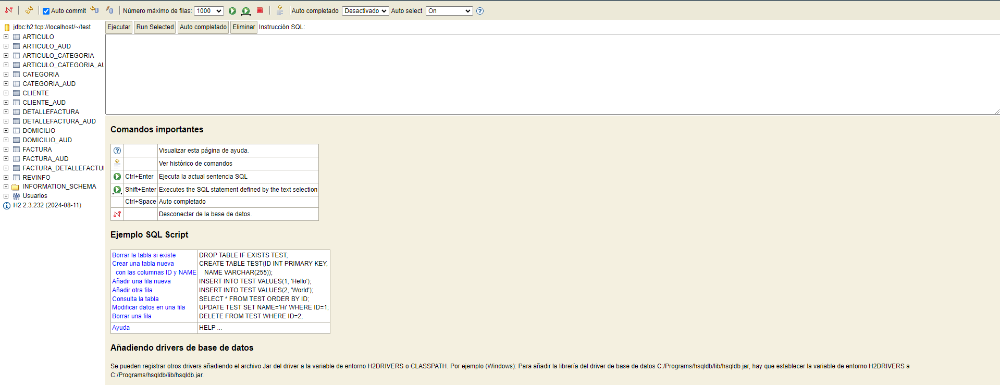
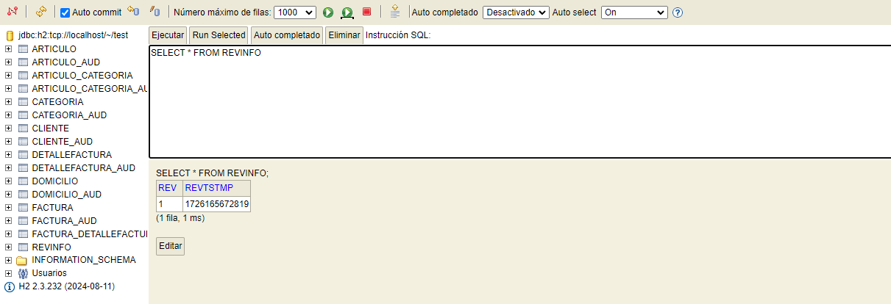
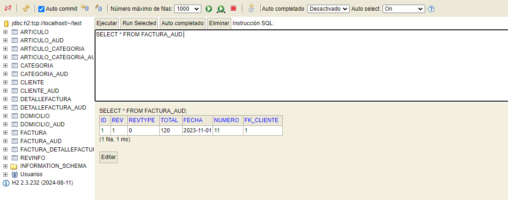
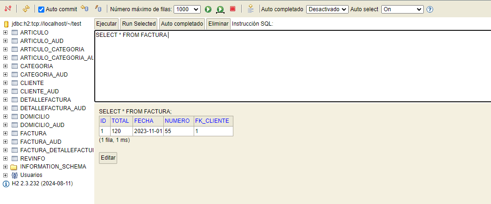
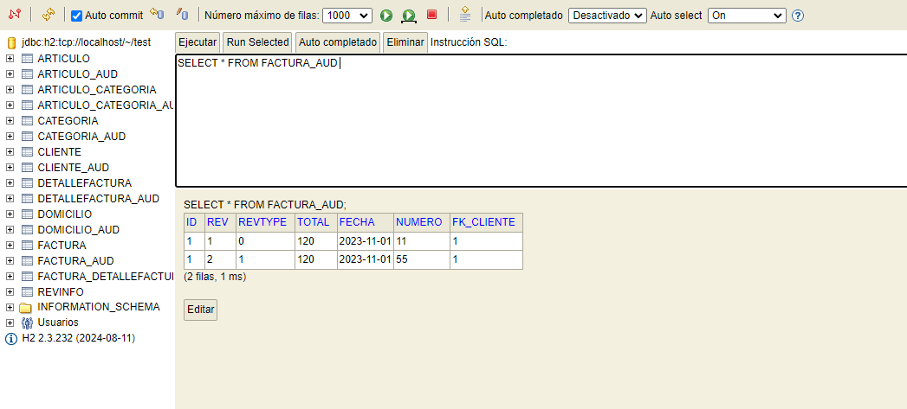
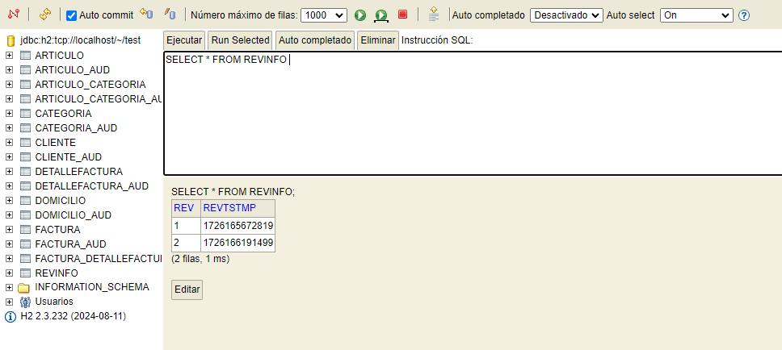

## Desarrollo de Sofware - Trabajo Practico JPA con Envers
## Autor

**Matias Fernández** - Legajo: **49483** - Comisión **3K10**

## Descripcion
Este proyecto ejemplifica cómo implementar auditoría y versionado en una aplicación de bases de datos. Su propósito es registrar y rastrear todas las modificaciones realizadas en la base de datos, asegurando así la integridad y la transparencia de los datos.

## Características

*   **Auditoría**: Se documenta cada alteración en la base de datos, incluyendo la fecha y hora del cambio, el usuario responsable del mismo y los detalles asociados al cambio.
*   **Versionamiento**: Se conserva un historial de versiones de cada registro en la base de datos, permitiendo observar cómo ha evolucionado el registro a lo largo del tiempo.

## Tecnologías utilizadas

*   **Java**: lenguaje de programación utilizado para desarrollar la aplicación.
*   **Hibernate**: framework de persistencia de datos utilizado para interactuar con la base de datos.
*   **Envers**: biblioteca de Java utilizada para implementar la auditoría y el versionamiento.

## Funcionamiento

1.  **Registro de cambios**:  Cada modificación en la base de datos se documenta en una tabla de auditoría.
2.  **Creación de versiones**:  Al realizar un cambio en un registro, se genera una nueva versión del mismo, que se almacena en la base de datos.
3.  **Consulta de versiones**: Es posible consultar el historial de versiones de un registro para examinar cómo ha cambiado con el tiempo.

## Ventajas

*   **Integridad de los datos**: se garantiza la integridad de los datos al registrar y rastrear todos los cambios realizados.
*   **Transparencia**: se proporciona transparencia en la gestión de los datos, ya que se puede ver quién realizó cada cambio y cuándo.
*   **Seguridad**: se mejora la seguridad al mantener un historial de versiones de cada registro, lo que permite revertir cambios no deseados.

## Capturas de la Base de Datos H2
### Tablas AUD Creadas

### Tabla RevInfo

### Tabla Factura Aud Original

### Tabla Factura Modificada

### Tabla Factura AUD Modificada

### Tabla RevInfo luego de modificar

